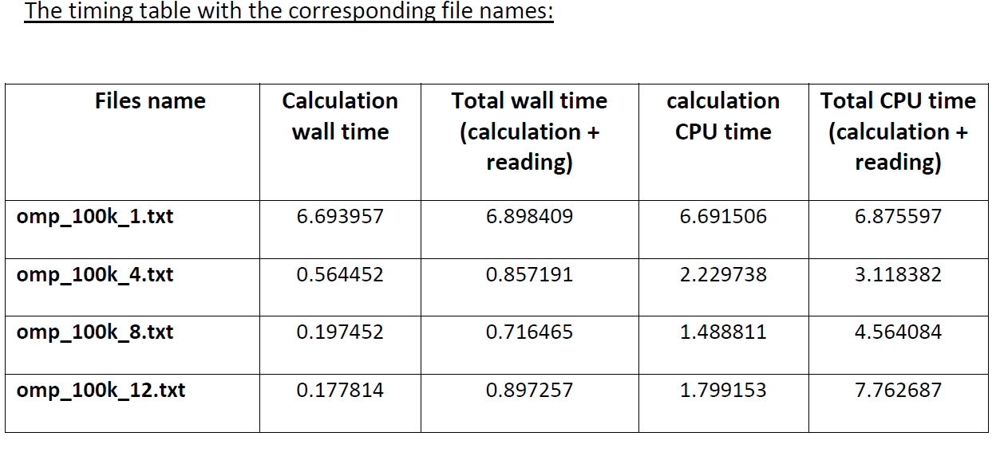

# Parallelization_nsertion_Sorting_OpenMP

This task introduces the OpenMP in parallelizing heavy complicated task of sorting 100k random numbers along with its corresponding element in the next column. Although it looks shorter in coding, but we give the computer a lot of control to utilize the use of cores which may not be optimal in some cases.

Below are the timings for sorting task done OpenMP within a single machine through the use of 1, 4, 8, and 12 threads.

Clearly we could see that the more threads we have the faster the timing is. But notably that going from one thread to 4 threads improved the time to be more than 10 times faster! The reason behind that – from my point of view – is probably due to the complexity of the code and its notation whether it’s N, N squared, or N cubed. The steeper the curve of a certain algorithm from a specific order - N squared – the faster the performance is especially when comparing the serial with a parallel of low thread-number (something similar to an exponential decay curve)
Something to indicate also is the total time which may be a bit slower than a code with a lower thread number. Although the calculation times are faster with more threads, but maybe to the printing process of the threads outputs to the file “parallel_sorted.txt” takes more time to finish when using higher number of threads. This can be explained by the “pragma omp ordered” which forces the process of printing to a file to become more of a sequential rather than parallel, yet this part has to be done this way to ensure that the file produced contain elements with the right order.
To sum up, knowing the nature of this task needs some sort of parallelizing which tremendously improves the performance, but going excessively with high number of threads doesn’t achieve significant improvement. Thus, knowing the nature of the problem makes it easier for us to understand how to parallelize a code in the best possible way.
